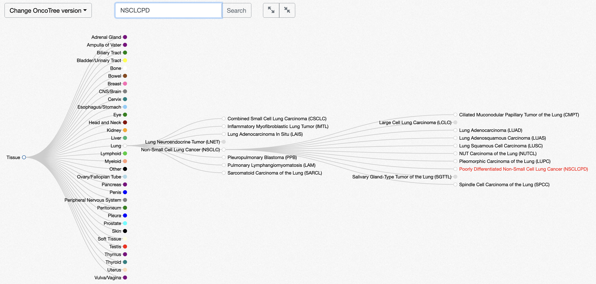

# Sample File

## Sample Headers

All the MOHCCN field names under the _ICGC ARGO schema_ 'Sample Registration', and 'Specimen' are located in this file as they pertain to the sample level attributes.

<table><thead><tr><th width="145">PATIENT_ID</th><th width="126">SAMPLE_ID</th><th width="155">CANCER_TYPE</th><th width="242">CANCER_TYPE_DETAILED</th><th width="185">ONCOTREE_CODE</th><th width="167">SAMPLE_CLASS</th><th width="141">PROGRAM_ID</th><th width="147">PRIMARY_SITE</th><th width="260">SPECIMEN_TISSUE_SOURCE</th><th width="302">TUMOUR_NORMAL_DESIGNATION</th><th width="176">SPECIMEN_TYPE</th><th width="233">SUBMITTER_SAMPLE_ID</th><th width="157">SAMPLE_TYPE</th><th width="336">SUBMITTER_PRIMARY_DIAGNOSIS_ID</th><th width="266">SUBMITTER_TREATMENT_ID</th><th width="276">SPECIMEN_COLLECTION_DATE</th><th width="303">SPECIMEN_ANATOMIC_LOCATION</th><th width="286">TUMOUR_HISTOLOGICAL_TYPE</th><th width="447">REFERENCE_PATHOLOGY_CONFIRMED_DIAGNOSIS</th><th width="526">REFERENCE_PATHOLOGY_CONFIRMED_TUMOUR_PRESENCE</th><th width="271">TUMOUR_GRADING_SYSTEM</th><th width="184">TUMOUR_GRADE</th><th width="320">PERCENT_TUMOUR_CELLS_RANGE</th><th width="466">PERCENT_TUMOUR_CELLS_MEASUREMENT_METHOD</th><th width="207">SPECIMEN_STORAGE</th><th width="228">SPECIMEN_PROCESSING</th><th width="240">SPECIMEN_LATERALITY</th><th></th></tr></thead><tbody><tr><td></td><td></td><td></td><td></td><td></td><td></td><td></td><td></td><td></td><td></td><td></td><td></td><td></td><td></td><td></td><td></td><td></td><td></td><td></td><td></td><td></td><td></td><td></td><td></td><td></td><td></td><td></td><td></td></tr><tr><td></td><td></td><td></td><td></td><td></td><td></td><td></td><td></td><td></td><td></td><td></td><td></td><td></td><td></td><td></td><td></td><td></td><td></td><td></td><td></td><td></td><td></td><td></td><td></td><td></td><td></td><td></td><td></td></tr><tr><td></td><td></td><td></td><td></td><td></td><td></td><td></td><td></td><td></td><td></td><td></td><td></td><td></td><td></td><td></td><td></td><td></td><td></td><td></td><td></td><td></td><td></td><td></td><td></td><td></td><td></td><td></td><td></td></tr></tbody></table>

### Legend

Black and bold font are mandatory cBioportal headers

* **PATIENT\_ID** = "submitter\_donor\_id"
* **SAMPLE\_ID** = "submitter\_specimen\_id"
* The **CANCER\_TYPE** field would be the general cancer type name.\
  &#x20;       The name in the base level after ‘Tissue’ on the Oncotree Map\
  &#x20;               For example: “Lung”
* The **CANCER\_TYPE\_DETAILED** field would be the name of the specific cancer type (going down the Oncotree map)\
  &#x20;       For example: “Poorly Differentiated Non-Small Cell Lung Cancer”
* The **ONCOTREE\_CODE** field would be the acronym of the Cancer Type Detailed name in the “CANCER\_TYPE\_DETAILED” field\
  &#x20;       For example: “NSCLCPD”

<figure><figcaption></figcaption></figure>

#### cBioPortal suggested columns in _<mark style="color:blue;">blue italics</mark>_:

From the cBioPortal Documentation, the following columns affect the header of the patient view by adding text to the samples in the header:

* _<mark style="color:blue;">SAMPLE\_DISPLAY\_NAME</mark>_: displayed in addition to the ID
* _<mark style="color:blue;">SAMPLE\_CLASS</mark>_: classifies the sample and when this column is present, the samples on the patient view header becomes a different colour with an icon next to the SAMPLE\_ID
  * For example, values can be: cfDNA, Tumor, Primary, Metastasis, Xenograft, etc
* _<mark style="color:blue;">METASTATIC\_SITE</mark>_ or _<mark style="color:blue;">PRIMARY\_SITE</mark>_: Override _<mark style="color:blue;">TUMOR\_SITE</mark>_ (patient level attribute) depending on sample type

The following columns additionally affect the Timeline data visualization:

* _<mark style="color:blue;">SAMPLE\_TYPE</mark>_, _<mark style="color:blue;">TUMOR\_TISSUE\_SITE</mark>_ or _<mark style="color:blue;">TUMOR\_TYPE</mark>_: gives sample icon in the timeline a colour.
  * If set to recurrence, recurred, progression or progressed: orange
  * If set to metastatic or metastasis: red
  * If set to primary or otherwise: black


For more information about the clinical sample columns, please visit the [official cBioPortal documentation](https://docs.cbioportal.org/5.1-data-loading/data-loading/file-formats#clinical-sample-columns), and our [MetaData Standardization](../../file-formats/clinical-files-format/metadata-standardization.md) and [Clinical Sample File: OncoTree Code](../../file-formats/clinical-files-format/clinical-sample-file-oncotree-code.md) pages within the File Formats section

