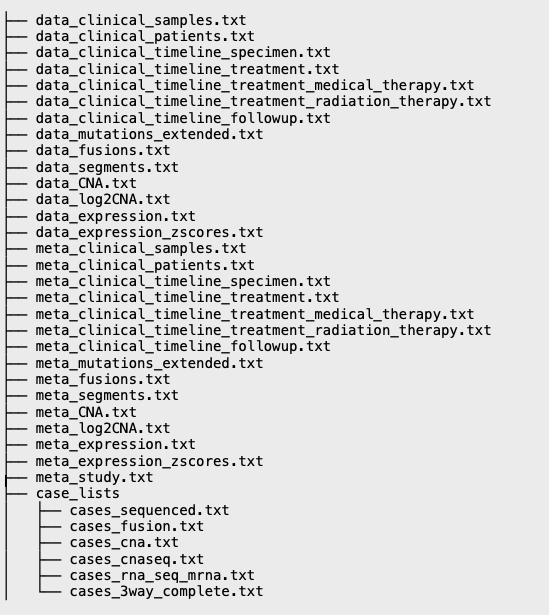

# File Formats

The following table is organized by: the type of genomic data, its required format (also cBioPortal suggested filename convention - the link provided directs users to the specific section in the official [cBioPortal.org's documentation website](https://docs.cbioportal.org/5.1-data-loading/data-loading/file-formats#formats)), comments, and the mandatory associated meta file for the data file. For every data file in the import directory, there must be a meta file for it.

To setup and create a "minimal" cBioPortal project, you will need the following files:

* [meta\_study.txt](https://docs.cbioportal.org/file-formats/#meta-file)
* [meta\_clinical\_samples.txt](https://docs.cbioportal.org/file-formats/#meta-files)
* [data\_clinical\_samples.txt](https://docs.cbioportal.org/file-formats/#clinical-sample-columns)
* [case\_lists/](https://docs.cbioportal.org/file-formats/#case-lists)
  * [cases\_sequenced.txt](https://docs.cbioportal.org/file-formats/#required-case-lists)

**NOTE**: The more data that is provided, the better your project will be, and will be able to use cBioPortal's features. Creating a project with the bare minimal data will not be very useful to the user.


#### Please use _consistent sample IDs_ across all files (genomic and clinical files) – watch out for underscores and dashes!


### Data Types Summary Table

| Platform (data type)                                                                    | Required format                                                                                                                 | Alternate formats                                                                                                                | Notes                                                                                                                                            | Associated meta file                       |
| --------------------------------------------------------------------------------------- | ------------------------------------------------------------------------------------------------------------------------------- | -------------------------------------------------------------------------------------------------------------------------------- | ------------------------------------------------------------------------------------------------------------------------------------------------ | ------------------------------------------ |
| Clinical (Sample centric)                                                               | [data\_clinical_\__samples.txt](https://docs.cbioportal.org/5.1-data-loading/data-loading/file-formats#clinical-sample-columns) |                                                                                                                                  | Samples file is mandatory; this file is where the mapping of the sample IDs happen (all sample IDs across all files, genomic and clinical files) | meta\_clinical\_samples.txt                |
| Clinical (Patient centric)                                                              | [data\_clinical_\__patients.txt](https://docs.cbioportal.org/5.1-data-loading/data-loading/file-formats#clinical-data)          |                                                                                                                                  |                                                                                                                                                  | meta\_clinical\_patients.txt               |
| WGS (SNV/Indels)                                                                        | [data\_mutations\_extended.txt](https://docs.cbioportal.org/5.1-data-loading/data-loading/file-formats#mutation-data)           |                                                                                                                                  | Must be in MAF format; Run [vcf2maf](https://github.com/mskcc/vcf2maf)                                                                           | meta\_mutations\_extended.txt              |
| WGS (Structural Variants)                                                               | [data\_sv.txt](https://docs.cbioportal.org/5.1-data-loading/data-loading/file-formats#structural-variant-data)                  | [mavis\_summary\_\*.tab file](http://mavis.bcgsc.ca/docs/latest/mavis.summary.html?highlight=output)                             | cBioportal is still working on this; if you have fusions file instead, its fine                                                                  | meta\_sv.txt                               |
| RNA-Seq (Expression)                                                                    | [data\_expressions.txt](https://docs.cbioportal.org/5.1-data-loading/data-loading/file-formats#expression-data)                 |                                                                                                                                  |                                                                                                                                                  | meta\_expressions.txt                      |
| RNA-Seq (Fusion)                                                                        | [data\_fusions.txt](https://docs.cbioportal.org/5.1-data-loading/data-loading/file-formats#fusion-data)                         | [mavis\_summary\_\*.tab file](http://mavis.bcgsc.ca/docs/latest/mavis.summary.html?highlight=output)                             |                                                                                                                                                  | meta\_fusions.txt                          |
| Segmented (Seg)                                                                         | [data\_segments.seg](https://docs.cbioportal.org/5.1-data-loading/data-loading/file-formats#segmented-data)                     |                                                                                                                                  |                                                                                                                                                  | meta\_segments.txt                         |
| Discrete Copy Number (CNA)                                                              | [data\_CNA.txt](https://docs.cbioportal.org/5.1-data-loading/data-loading/file-formats#discrete-copy-number-data)               |                                                                                                                                  |                                                                                                                                                  | meta\_CNA.txt                              |
| Methylation                                                                             | [data\_methylation.txt](https://docs.cbioportal.org/5.1-data-loading/data-loading/file-formats#methylation-data)                |                                                                                                                                  |                                                                                                                                                  | meta\_methylation.txt                      |
| Protein (RPPA/Mass Spectrometry)                                                        | [protein data](https://docs.cbioportal.org/5.1-data-loading/data-loading/file-formats#protein-level-data)                       | data\_protein\_quantification.txt                                                                                                | Depends if you have RPPA or Mass Spectrometry data; Log2value or z-score datatypes                                                               | meta\_protein\_quantification.txt          |
|                                                                                         |                                                                                                                                 | data\_protein\_quantification\_Zscores.txt                                                                                       |                                                                                                                                                  | meta\_protein\_quantification\_Zscores.txt |
|                                                                                         |                                                                                                                                 | data\_rppa.txt                                                                                                                   |                                                                                                                                                  | meta\_rppa.txt                             |
|                                                                                         |                                                                                                                                 | data\_rppa\_Zscores.txt                                                                                                          |                                                                                                                                                  | meta\_rppa\_Zscores.txt                    |
|                                                                                         |                                                                                                                                 | [data\_phosphoprotein\_quantification.txt](https://docs.cbioportal.org/5.1-data-loading/data-loading/file-formats#generic-assay) |                                                                                                                                                  | meta\_phosphoprotein\_quantification.txt   |
| [Other formats](https://docs.cbioportal.org/5.1-data-loading/data-loading/file-formats) |                                                                                                                                 |                                                                                                                                  |                                                                                                                                                  |                                            |


**A samples file (aka data\_clinical\_samples.txt) is mandatory for a project import! It is the key file in mapping of the project's IDs.**&#x20;


### Skeleton of the directory structure

<figure><figcaption>
An example of how a directory of import files would look like
</figcaption></figure>


For more information on what the case\_list directory is and what case files are, please refer to the [Case List Files section](case-lists-files.md)

