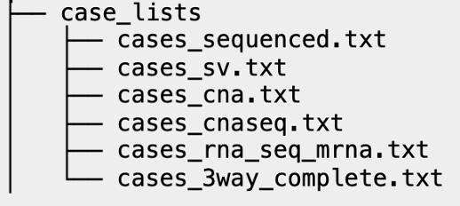

# Case Lists Files

For a successful project import, there must be a sub-directory called [`case_list`](https://docs.cbioportal.org/5.1-data-loading/data-loading/file-formats#case-lists) within the import files folder. Within this case\_list directory, there must be **at least a cases\_sequenced.txt file**.&#x20;

Case lists are defined lists of sample IDs that can be selected on the query page.

Please refer to the official cBioPortal documentation for the required fields for a case list file [https://docs.cbioportal.org/5.1-data-loading/data-loading/file-formats#case-lists](https://docs.cbioportal.org/5.1-data-loading/data-loading/file-formats#case-lists)


For most genomic files, there will need to be an associated case file for it. Please see the  the [list of stable\_id suffixes](https://docs.cbioportal.org/file-formats/#case-list-stable-id-suffixes) on the official cBioPortal documentation.


| case\_list directory                                                                                                                                    |
| ------------------------------------------------------------------------------------------------------------------------------------------------------- |
| a.     All samples sequenced (across all genomic files) and all samples in the clinical samples file must be indicated in a “cases\_sequenced.txt” file |
| b.     If there is a fusion file, those SAMPLE\_IDs must be listed in a “cases\_fusion.txt” file                                                        |
| c.     If there is a seg file, those SAMPLE\_IDs must be listed in a “cases\_cnaseq.txt” file                                                           |
| d.     If there is a CNA file, those SAMPLE\_IDs must be listed in a “cases\_cna.txt”                                                                   |
| e.     If there is any other genomic file, they must have a corresponding case list file as well                                                        |

#### Example of the case\_list directory

<figure><figcaption>
A typical case_lists directory containing case list files
</figcaption></figure>
