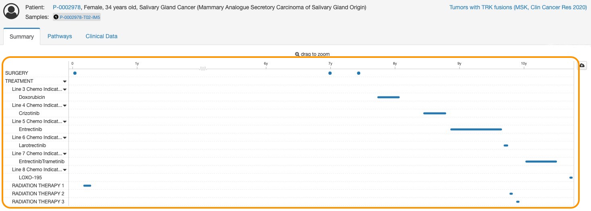

# Clinical Timeline Setup

Clinical Timeline on cBioPortal provides a visualization of a patient's treatment journey all the way from their date of diagnosis. Below is an example of what a clinical timeline looks like. The next few pages guides users to setup their data into acceptable cBioPortal formatted files to create something like this.

<figure><figcaption>
An example of a clinical timeline for a patient from cBioPortal.org (<a href="http://www.cbioportal.org/patient?studyId=ntrk_msk_2019&#x26;caseId=P-0002978">http://www.cbioportal.org/patient?studyId=ntrk_msk_2019&#x26;caseId=P-0002978</a>)
</figcaption></figure>
